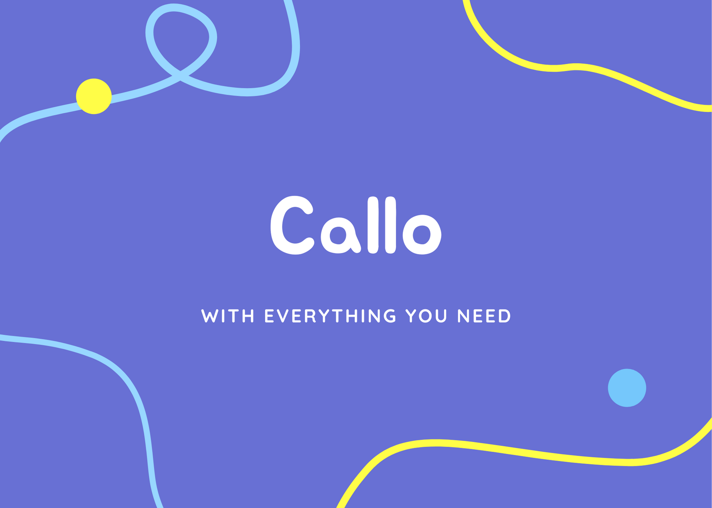

---

# Tools Used

## Languages

- [HTML](https://developer.mozilla.org/en-US/docs/Web/HTML)

- [CSS](https://developer.mozilla.org/en-US/docs/Web/CSS)

- [JavaScript](https://developer.mozilla.org/en-US/docs/Web/JavaScript)

- [Python](https://www.python.org)

## Data Storage

- [JSON](https://www.json.org)

## Frameworks

- [Flask](https://flask.palletsprojects.com)

- [Bootstrap](https://getbootstrap.com)

## Plugins/Extensions

- [Gunicorn](https://pypi.org/project/gunicorn)

- [JSON](https://docs.python.org/3/library/json.html)

---

# Forking Instructions

#### Fork the Project

First of all you need to fork the project from [here](https://github.com/Spacesters/Conal)

#### Get your blog posts

Previously I used npoint, but now the data is included in the project as file. All you need to do is just to edit the JSON and the website will update just as you wished.

---

#### Format of JSON

Here is the format of the JSON, because if anything gets messed up, the outcome your expecting won't appear.

> ID will always be a integer because it will the be the post number

> 

> Author will always be a string

> 

> Date will be a string or a int

> 

> ImageUrl will always be a string

> 

> Title will always be a string

> 

> Subtitle will always be a string

> 

> Body will always be a string

---

### TODO

- [x]  Add a another website for light mode

- [x]  Add a button or a slider to change from dark mode to light mode

---

### Credits

- [StartBootstrap](https://startbootstrap.com/)

- [Cruip](https://cruip.com/demos/switch/)

- [Landbot](https://www.landbot.io/)

- [Unsplash](https://unsplash.com/)

- [ImgBB](https://imgbb.com/)

- [404 Page](https://codepen.io/SusCasasola/pen/mLREVP)
